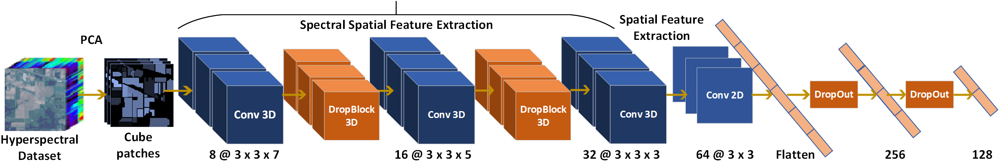

# Stable Prototypical Network (SPN)

The code repository for "SPN: Stable Prototypical Network for Few-Shot Learning-Based Hyperspectral Image Classification" [[paper]](https://ieeexplore.ieee.org/abstract/document/9455864) (GRSL'22) in Tensorflow. 

## SPN: Stable Prototypical Network for Few-Shot Learning-Based Hyperspectral Image Classification

We tackle the problem of few-shot image classification in the context of remote sensing hyperspectral images (HSIs). Due to the difficulties in collecting a large number of labeled training samples, the few-shot classification techniques hold much prominence in remote sensing in general. One of the bottlenecks in designing few-shot learning (FSL) systems arises from the fact that the model is likely to overfit in the presence of few training samples and the complex spectral feature distributions of the land-cover classes. To this end, we introduce a stable prototypical network (SPN) for FSL by judiciously incorporating dropout and DropBlock-based regularizers jointly within the framework and averaging model parameters using the Monte Carlo approximation. Besides, a novel variance loss term to reduce the uncertainty of the network is considered together with the cross-entropy-based classification loss to train the model in an end-to-end manner. The experimental analysis on three benchmark HSI datasets confirms the SPN’s superior performance.

## Prerequisites

The following packages are required to run the scripts:

- [Tensorflow 2.1](https://www.tensorflow.org/)
- [sklearn 0.21.2](https://scikit-learn.org/stable/)
- [numpy 1.16.4](https://numpy.org/)
- [matplotlib 3.1.1](https://matplotlib.org/)
- [scipy 1.3.0](https://scipy.org/)
- [spectral 0.21](https://www.spectralpython.net/)

## Dataset

### Indian Pines, Salinas
Download from (http://www.ehu.eus/ccwintco/index.php/Hyperspectral_Remote_Sensing_Scenes) 

### Houston-2013
Download from (https://hyperspectral.ee.uh.edu/?page_id=459)

## Source Code
The codes for meta-training, fine-tuning and meta-testing on 3 benchmark HSI datasets are available in src folder with name as "SPN_<Dataset_name>_5shot". The code is configured for 5-way 5-shot recognition. 

## Citation  
If you use any content of this repo for your work, please cite the following bib entry:

	@ARTICLE{9455864,
    author    = {Pal, Debabrata and Bundele, Valay and Banerjee, Biplab and Jeppu, Yogananda},
    journal={IEEE Geoscience and Remote Sensing Letters},
    title     = {SPN: Stable Prototypical Network for Few-Shot Learning-Based Hyperspectral Image Classification},
    year      = {2022},
    volume    = {19},
    number    = {},
    pages     = {1-5},
    doi       = {10.1109/LGRS.2021.3085522}
	}
